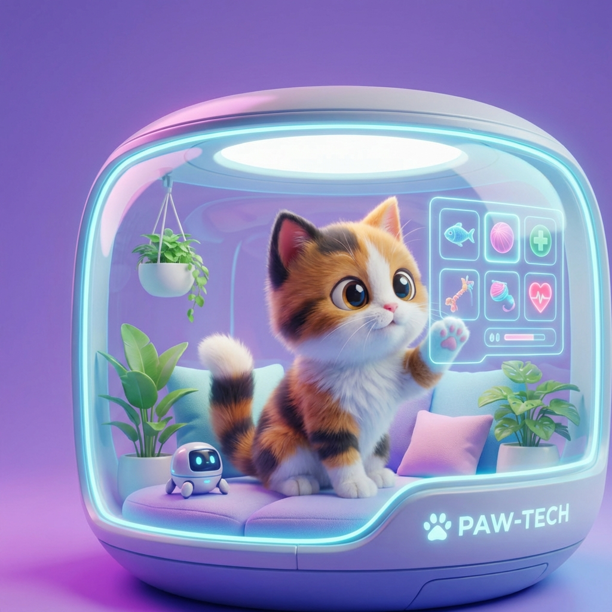

# PurrfectHub



## 📋 Overview

**PurrfectHub** is a modern, feature-rich platform designed to connect cat lovers with their future feline companions. Built with the latest web technologies, it offers a seamless and engaging experience for browsing adoptable cats, managing adoption applications, and fostering a community of pet enthusiasts.

## ✨ Features

- **Cat Listings**: Browse a wide variety of cats available for adoption with detailed profiles.
- **Advanced Search**: Filter cats by breed, age, color, and more to find your perfect match.
- **User Accounts**: Secure authentication and profile management for adopters and shelters.
- **Responsive Design**: Optimized for all devices, from desktops to mobile phones.
- **Modern UI/UX**: A clean, intuitive interface built with Shadcn UI and Tailwind CSS.
- **Dark Mode**: Fully supported dark mode for comfortable viewing in any lighting.

## 🛠️ Tech Stack

- **Framework**: [Next.js 16](https://nextjs.org/) (App Router)
- **Language**: [TypeScript](https://www.typescriptlang.org/)
- **Styling**: [Tailwind CSS 4](https://tailwindcss.com/)
- **Components**: [Shadcn UI](https://ui.shadcn.com/)
- **Icons**: [Lucide React](https://lucide.dev/) & [React Icons](https://react-icons.github.io/react-icons/)
- **Forms**: [React Hook Form](https://react-hook-form.com/) + [Zod](https://zod.dev/)
- **State Management**: React Hooks & Context API
- **Utilities**: [clsx](https://github.com/lukeed/clsx) & [tailwind-merge](https://github.com/dcastil/tailwind-merge)

## 🚀 Getting Started

Follow these steps to set up the project locally on your machine.

### Prerequisites

- [Node.js](https://nodejs.org/) (Version 18 or later)
- [npm](https://www.npmjs.com/), [yarn](https://yarnpkg.com/), or [pnpm](https://pnpm.io/)

### Installation

1. **Clone the repository**
   ```bash
   git clone https://github.com/Emtiaz-ahmed-13/purrfecthub_client.git
   cd purrfecthub_client
   ```

2. **Install dependencies**
   ```bash
   npm install
   # or
   yarn install
   # or
   pnpm install
   ```

3. **Run the development server**
   ```bash
   npm run dev
   # or
   yarn dev
   # or
   pnpm dev
   ```

4. **Open your browser**
   Navigate to [http://localhost:3000](http://localhost:3000) to see the application running.

## 📂 Project Structure

```bash
src/
├── app/              # Next.js App Router pages and layouts
├── components/       # Reusable UI components
│   ├── auth/         # Authentication related components
│   ├── home/         # Homepage specific components
│   ├── layout/       # Global layout components (Navbar, Footer)
│   └── ui/           # Shadcn UI primitives
├── lib/              # Utility functions and configuration
└── models/           # TypeScript interfaces and types
```

## 🤝 Contributing

Contributions are welcome! Please feel free to submit a Pull Request.

1. Fork the project
2. Create your feature branch (`git checkout -b feature/AmazingFeature`)
3. Commit your changes (`git commit -m 'Add some AmazingFeature'`)
4. Push to the branch (`git push origin feature/AmazingFeature`)
5. Open a Pull Request

## 📄 License

This project is open source and available under the information in the repository.

---

Built with ❤️ by [Emtiaz Ahmed](https://github.com/Emtiaz-ahmed-13)
